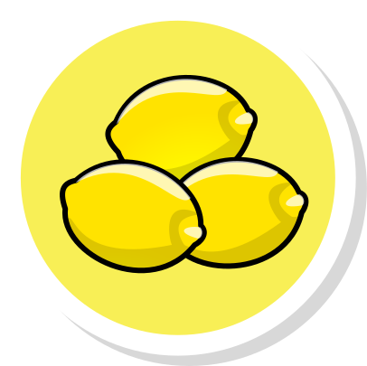

## Lemon:  A framework for rapidly mining structural information from the Protein Data Bank



[](http://chopralab.github.io/lemon)
[](https://travis-ci.org/chopralab/lemon)
[](https://circleci.com/gh/chopralab/lemon)
[](https://ci.appveyor.com/project/frodofine/lemon/branch/master)
[](https://coveralls.io/github/chopralab/lemon?branch=master)
[](https://badge.fury.io/py/candiy-lemon)

### What is Lemon's purpose?

**Lemon** is a tool for mining features used in downstream structural biology software dealing with 3D Macromolecules.  It is designed to be fast and flexible, allowing users to quickly query the 3D features of a given collection of 3D structures.  To do so, the user writes a workflow function which is applied to all the structures in the PDB. Currently, these workflows can be developed using C++(typically through lambdas) and Python.

Due to the incredibly fast parsing speed of the MMTF format, Lemon uses this format by default.  This helps **Lemon** query the entire Protein Data Bank under 10 minutes on an 8 core machine. Lemon handles all the threading, compression, and MMTF parsing leaving the rest up to the user!

With these ideas in mind, the major, and crucial role of **Lemon** is the creation of standardized workflows for mining structural features. Since **Lemon** handles the rest, these workflows can be used for any future versions of the PDB. Hopefully, the structural biology community can use our software to replace custom/in-house scripts that need to be run on the ever growing PDB!

### How do I obtain Lemon?

Technically speaking, **Lemon** is a *header-only* library. This means to use lemon in your own project, just copy the `include/lemon` directory into your project and include the file `lemon/lemon.hpp`. There is *no* need to link a special library or package.

**Lemon** is developed to have as few dependencies as possible. You only need a recent C++ compiler which supports C++11. If you plan on building Python support, you will also need a copy of the Python interpreter and occompaning libraries and header files. All other dependencies are installed for you by the build system.

```bash
git clone https://github.com/chopralab/lemon.git

cd lemon

mkdir build

cd build

cmake .. -DCMAKE_BUILD_TYPE=Release

make -j 2

```

### How does one use Lemon?

The Protein Data Bank is used to test **Lemon**'s capabilites and is the source of the majority of structural biology benchmarking sets.  Therefore we have included a script to download the entire PDB archive.  It is recommended to use the latest Hadoop sequence files located [here](https://mmtf.rcsb.org/v1.0/hadoopfiles/full.tar).

Currently, the archive takes ~9Gb of space.

To run **Lemon**, select a program. For example, if one wants to query all the small molecules which interact with `SAM`, use the following command:

```bash
tar xf full.tar /dev/shm/
/path/to/lemon/build/progs/count_sam_small_molecules -w /dev/shm/full -n <number of cores>
```

The results for this program are printed to `stdout`.

**Lemon** is &copy; 2018 Chopra Lab and Purdue University. Developed by Jonathan Fine and is available as open source under the terms of the [BSD License](http://opensource.org/licenses/BSD). 
